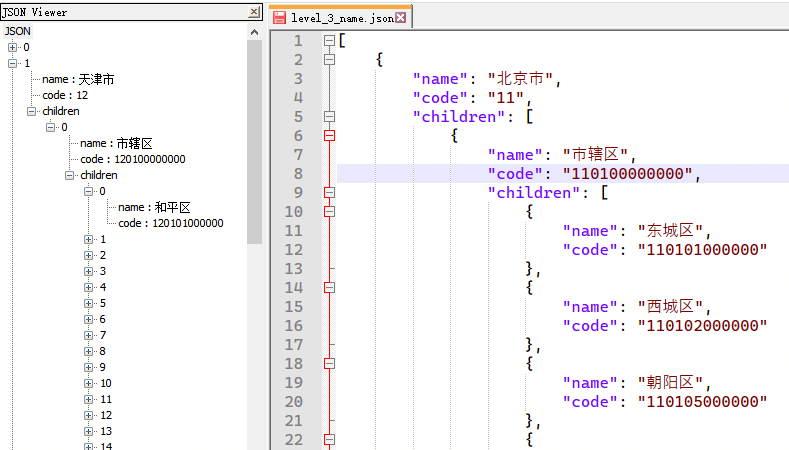
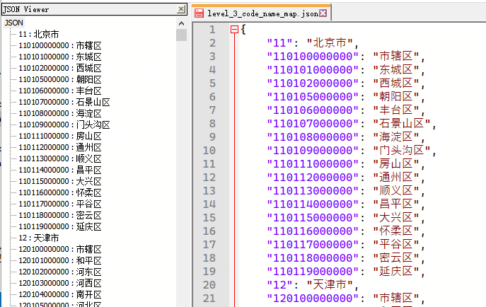
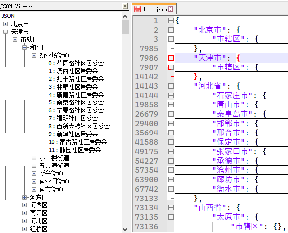

# 中华人民共和国行政区划

> 来源 [国家统计局](http://www.stats.gov.cn/tjsj/tjbz/tjyqhdmhcxhfdm/2020/)

## 数据
|数据文件|说明|
|--|--|
|`level_N_code_name`|N 层代码名称联动 json|
|`level_N_code_name_map`|N 层代码名称映射 json|
|`level_N_name`|N 层名称联动 json|

### 数据示例

#### `level_N_code_name`

#### `level_N_code_name_map`

#### `level_N_name`

## 脚本
1. `download_all_data.py` 下载所有的数据
2. `download_level_3.py` 仅获取三层数据

|脚本文件|描述|层数信息|
|--|--|--|
|`download_all_data.py`|获取所有层|province + city + county + town + village|
|`download_level_3.py`|获取前三层|province + city + county|

## 行政区域构架

## 注意点
1. 直辖市，如「北京市」
2. 「市辖区」
3. 「省直辖县级行政区划」